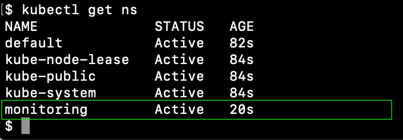
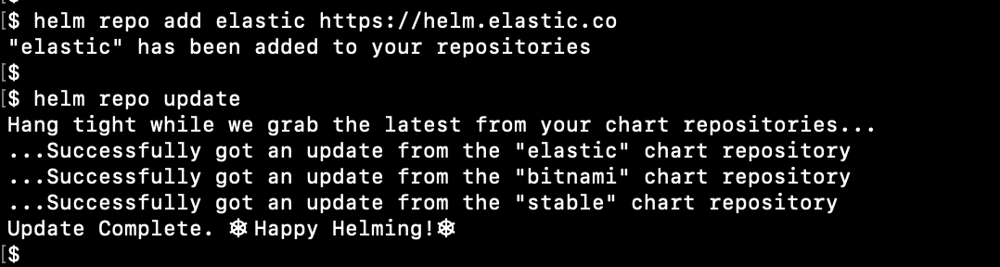

# Example of EFK in K8S cluster


# Example

* the kubernetes cluster with configured persistent volumes and ingress-controller
* **kubectl** ([installation guide is here](https://kubernetes.io/docs/tasks/tools/install-kubectl/)), **helm** ([installation guide is here](https://helm.sh/docs/intro/install/))
* example domain **kibana.example.com**


# Namespace

Create the monitoring namespace
```
kubectl create namespace monitoring
```




# Elasticsearch
Install Elasticsearch from [this helm chart](https://github.com/elastic/helm-charts/tree/master/elasticsearch) 

Add and update elastic helm repository
```
helm repo add elastic https://helm.elastic.co
helm repo update
```

