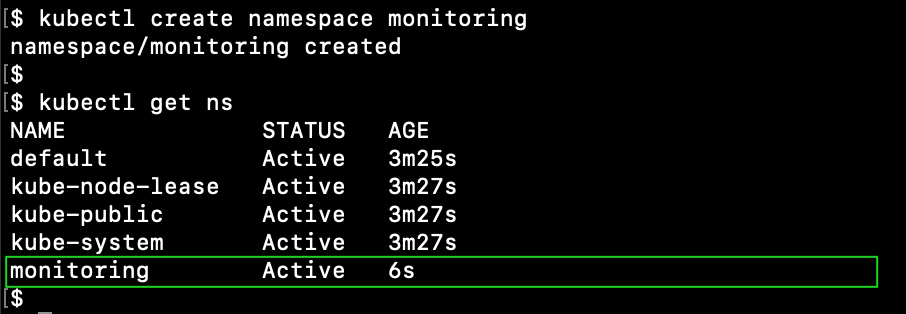

# Example of EFK in K8S cluster


# Example

* the kubernetes cluster with configured persistent volumes and ingress-controller
* **kubectl** ([installation guide is here](https://kubernetes.io/docs/tasks/tools/install-kubectl/)), **helm** ([installation guide is here](https://helm.sh/docs/intro/install/))
* example domain **kibana.example.com**


# Namespace

Create the monitoring namespace
```
kubectl create namespace monitoring
```




# Elasticsearch
Install Elasticsearch from [this helm chart](https://github.com/elastic/helm-charts/tree/master/elasticsearch) 

Add and update elastic helm repository
```
helm repo add elastic https://helm.elastic.co
helm repo update
```


Deploy elasticsearch release from the helm chart
```
helm install elasticsearch elastic/elasticsearch --set imageTag="7.9.1" -n monitoring
```
or if you want to change the storage size
```
helm install elasticsearch elastic/elasticsearch --set imageTag="7.9.1",volumeClaimTemplate.resources.requests.storage="60Gi" -n monitoring
```


# Kibana

Deploy [Kibana manifests](kibana/)

```
kubectl apply -f kibana/
```


# Example domain

Add our example domain to **/etc/hosts**
```
34.66.45.242  kibana.example.com
```

# Kibana Lifecycle Policy

Open Kibana in web-browser **kibana.example.com**

Create Index Lifecycle Policy to delete stale indices

Go to the side menu and open **Management**/**Dev Tools**


Next request will create **Index Lifecycle Policy**, that will delete indices older that 20 days
```
PUT _ilm/policy/delete-20-days
{
    "policy" : {
      "phases" : {
        "delete" : {
          "min_age" : "20d",
          "actions" : {
            "delete" : { }
          }
        }
      }
    } 
}
```


Next request will create **Index Template** and bind the created lifecycle policy

```
PUT _template/example_template
{
  "index_patterns": ["example-*"],
  "settings": {
    "index.lifecycle.name": "delete-20-days"
  }
}
```


Now all indices that match the example index template will apply that lifecycle policy when created.


# Fluent Bit

[Official installation guide](https://docs.fluentbit.io/manual/installation/kubernetes#installation)

Deploy [FluentBit manifests](fluentbit/)

```
kubectl apply -f fluentbit/
```


**configmap.yaml** - configuration for Fluent Bit
* INPUT - define Tag Regex to match by namespace
* FILTER - define custom parser 'k8s-custom-tag'
* OUTPUT - match only **example** namespace and write to **example** index
* PARSER - parser for defined tag regex


# Generate demo data

Create the example namespace
```
kubectl create namespace example
```

Deploy log-generator pod
```
kubectl apply -f example/pod.yaml
```


# Check out example logs

Open Kibana in web-browser **kibana.example.com**


Go to the side menu and open **Management**/**Stack Management**/**Index Management**

Check out our new **example** index


Check out the index detail info about the lifecycle policy


Create new Index Pattern for our example indecies. It should match all indecies that start with 'example'.


Select time field **@timestamp**


Check out logs from the log generator. Go to the side menu and open **Kibana**/**Discover** and select the index pattern.


